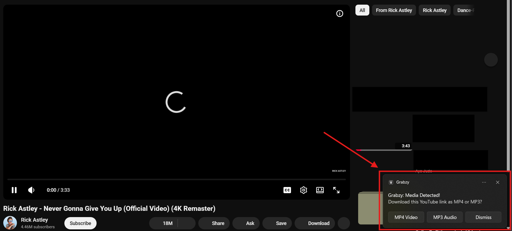
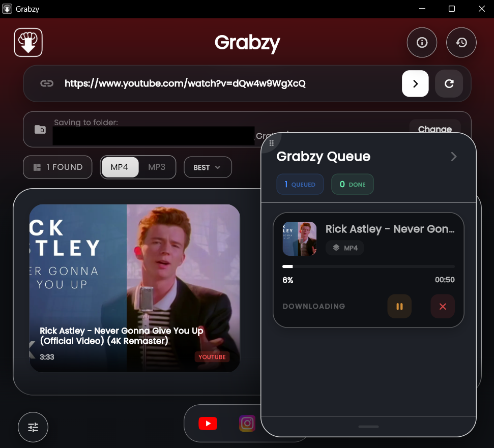
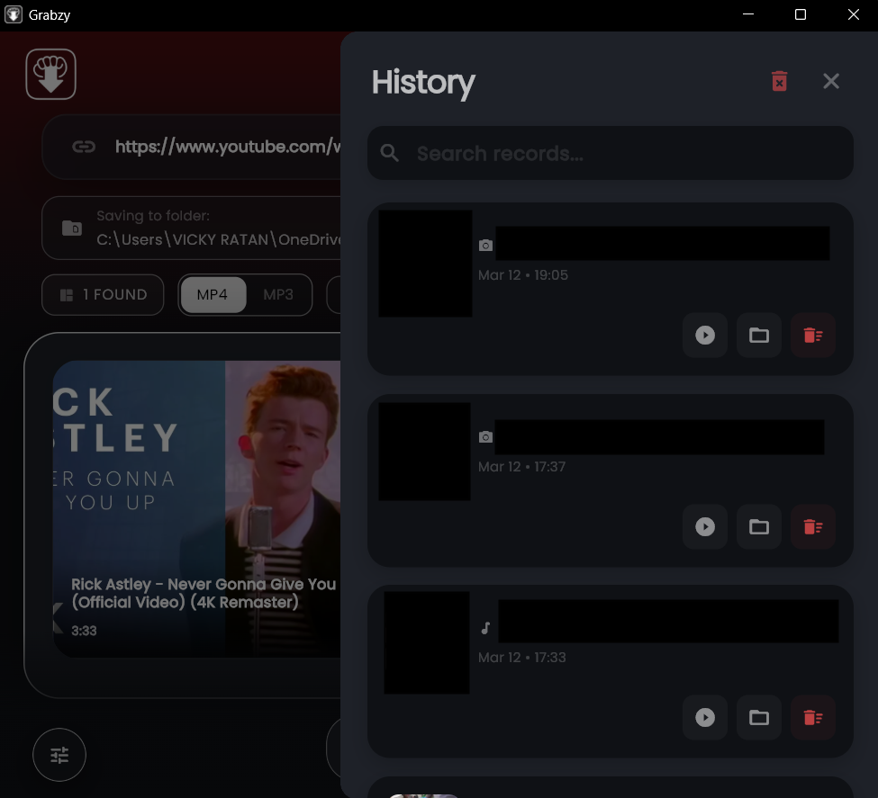

<div align="center">


# ⚡ Grabzy

### The Smart Open-Source Social Media Downloader for Desktops

**Download videos from YouTube, Instagram & TikTok — instantly, automatically, beautifully.**

[](https://github.com/v43ky/grabzy/releases/latest)
[](https://github.com/v43ky/grabzy/releases)
[](https://flutter.dev)
[](https://github.com/yt-dlp/yt-dlp)
[](LICENSE)
[](#-installation)
[](https://github.com/v43ky/grabzy/stargazers)

<br>

[**Download for Windows**](#-installation) · [**Download for macOS**](#-installation) · [**Download for Linux**](#-installation) · [**Report a Bug**](https://github.com/v43ky/grabzy/issues) · [**Request a Feature**](https://github.com/v43ky/grabzy/issues)

<br>

</div>

---

## 📖 Table of Contents

- [What is Grabzy?](#-what-is-grabzy)
- [Why Grabzy?](#-why-grabzy)
- [Features](#-features)
- [Supported Platforms](#-supported-platforms)
- [Screenshots](#-screenshots)
- [Installation](#-installation)
- [How to Use](#-how-to-use)
- [Settings & Troubleshooting](#-settings--troubleshooting)
- [How It Works](#-how-it-works)
- [Building from Source](#-building-from-source)
- [Contributing](#-contributing)
- [Support the Project](#-support-the-project)
- [Roadmap](#-roadmap)
- [FAQ](#-faq)
- [License](#-license)

---

## 🤔 What is Grabzy?

Grabzy is a **free, open-source, cross-platform desktop application** that lets you download videos, reels, posts, and audio from YouTube, Instagram, and TikTok — without visiting any third-party website, without seeing ads, and without compromising your privacy.

It is built with **Flutter** and powered under the hood by **yt-dlp**, one of the most reliable and actively maintained video downloading engines in the world.

The philosophy behind Grabzy is simple:

> **Copy a link. That's it. Grabzy does the rest.**

The moment you copy any supported video link to your clipboard, Grabzy detects it automatically and sends you a notification to download it — no opening apps, no pasting links, no waiting. Just one click, and the video is downloading in the highest quality available.

---

## 💡 Why Grabzy?

You've probably tried downloading a video before. Here's how it usually goes:

1. Copy the link
2. Open a new browser tab
3. Google "Instagram reel downloader"
4. Click a sketchy website
5. Survive three popup ads
6. Click the wrong download button twice
7. Get a 480p watermarked file
8. Repeat for every single video

**Grabzy eliminates every single one of those steps.**

| The Old Way | With Grabzy |
|---|---|
| Open a website every time | Works silently in background |
| Popup ads and redirects | Zero ads, ever |
| Low quality downloads | Highest available quality automatically(upto 8k) |
| Watermarks on videos | Clean original files |
| One video at a time | Queue multiple downloads(upto 30) |
| No history | Full download history |
| Manual copy-paste every time | Auto-detects your clipboard |

---

## ✨ Features

### 🚀 Core Features

- **Clipboard Auto-Detection** — The moment you copy a YouTube, Instagram, or TikTok link anywhere on your computer, Grabzy detects it instantly and sends a notification. One click on the notification starts the download. No opening the app needed.



- **Smart Notifications** — Notification-triggered downloads always use the **highest quality available** automatically. No quality selection needed — Grabzy just grabs the best version of the video.

- **Quality Selection** — When pasting a link directly inside the app, Grabzy fetches all available resolutions and lets you choose: 4K, 1080p, 720p, 480p, 360p, or Audio Only. The available options are fetched in real time from the actual video — you only see qualities that actually exist.

- **Audio-Only Downloads** — Download just the audio track from any video as a clean MP3 file. Perfect for music, podcasts, lectures, and interviews.

- **Post & Carousel Downloading** — Download single Instagram photos and full carousel posts (multiple images in one post) with one click.

- **Reels & Short-Form Video** — Full support for Instagram Reels and TikTok videos in original quality.

- **Download Queue** — Add multiple links to the queue. Downloads run one after another automatically. See progress for each download in real time.

- **Full Download History** — Every download is saved to your history with the video title, thumbnail, platform, file size, date, and file path. Re-download or open any file directly from history.

### 🛠 Technical Features

- **Auto-Updating yt-dlp** — yt-dlp is checked for updates once daily and updated automatically in the background. If a download ever fails, Grabzy updates yt-dlp and retries automatically before showing any error.

- **Auto-Updating App** — Grabzy checks for new versions on startup. Regular updates show a gentle banner. Critical updates (when something is broken) show a prompt to ensure everyone stays on a working version.

- **Bundled ffmpeg** — Grabzy automatically downloads and manages ffmpeg silently on first launch. No manual installation needed. ffmpeg is stored in Grabzy's own tools folder and never touches your system.

- **Self-Healing Downloads** — If a download fails for a known reason (outdated yt-dlp, network hiccup, format unavailable), Grabzy automatically fixes the issue and retries before notifying you of any problem.

- **Smart Error Messages** — When something goes wrong, Grabzy tells you exactly what happened in plain English — not a raw error code dump — with a suggested fix for each error type.

- **Detailed Logging** — Every yt-dlp command and its output is logged to a local log file. If you ever need help, you can share logs directly from Settings with one click.

### 🎨 App Experience

- **Clean Modern UI** — Minimal, distraction-free interface. Everything you need, nothing you don't.
- **Download Speed Indicator** — See real-time download speed and estimated time remaining for each active download.
- **Platform Icons** — Every download shows the platform it came from so your history is always easy to scan.
- **Persistent Settings** — All your preferences are remembered across sessions.
- **Dark & Light Mode** — Follows your system theme automatically.

---

## 📱 Supported Platforms

### Operating Systems

| Platform | Status | Minimum Version |
|---|---|---|
| **Windows** | ✅ Fully Supported | Windows 10 or later |
| **macOS** | ✅ Fully Supported | macOS 11 (Big Sur) or later |
| **Linux** | ✅ Fully Supported | Ubuntu 20.04+ / most distros |

### Download Sources

| Platform | Videos | Photos/Posts | Carousels | Audio Only | Stories |
|---|---|---|---|---|---|
| **YouTube** | ✅ | ❌ | ❌ | ✅ | ❌ |
| **Instagram** | ✅ Reels | ✅ | ✅ | ✅ | 🔜 Coming Soon |
| **TikTok** | ✅ | ❌ | ❌ | ✅ | ❌ |

### Video Quality Support

| Quality | YouTube | Instagram | TikTok |
|---|---|---|---|
| Best Available | ✅ | ✅ | ✅ |
| 4K / 2160p | ✅ | ❌ | ❌ |
| 1080p | ✅ | ✅ | ✅ |
| 720p | ✅ | ✅ | ✅ |
| 480p | ✅ | ✅ | ✅ |
| 360p | ✅ | ✅ | ✅ |
| Audio MP3 | ✅ | ✅ | ✅ |

---

## 📸 In-app Experiences

<div align="center">

| Main Screen | Quality Picker | Download History |
|---|---|---|
|  |  |  |

| Notifications | Settings | Troubleshooting |
|---|---|---|
|  |  |  |

</div>

---

## 💾 Installation

### Windows

1. Go to the [**Latest Release**](https://github.com/v43ky/grabzy/releases/latest)
2. Download **`grabzy-windows.exe`**
3. Run the installer
4. Grabzy opens and sets itself up automatically (downloads ffmpeg and yt-dlp on first launch)
5. Done — start downloading

> **Note:** Windows may show a SmartScreen warning because the app is new and not yet widely recognized. Click **"More Info" → "Run Anyway"** to proceed. The app is completely safe and open source — you can verify the code yourself right here.

---

### macOS

1. Go to the [**Latest Release**](https://github.com/v43ky/grabzy/releases/latest)
2. Download **`grabzy-macos.dmg`**
3. Open the DMG and drag Grabzy to your Applications folder
4. On first launch, right-click the app → **Open** → **Open** again to bypass Gatekeeper
5. Grabzy sets itself up automatically
6. Done

> **Note:** macOS may say the app is from an unidentified developer since it is not yet notarized through Apple. Right-clicking and choosing Open bypasses this safely.

---

### Linux

1. Go to the [**Latest Release**](https://github.com/v43ky/grabzy/releases/latest)
2. Download **`grabzy-linux.AppImage`**
3. Make it executable:
```bash
chmod +x grabzy-linux.AppImage
```
4. Run it:
```bash
./grabzy-linux.AppImage
```
5. Grabzy sets itself up automatically on first launch

> **Tip for Linux users:** You can also move the AppImage to `/usr/local/bin/grabzy` for system-wide access.

---

## 🎯 How to Use

### Method 1 — Clipboard Detection (Recommended, Zero Effort)

This is the fastest way to use Grabzy and the feature that makes it unique.

1. **Launch Grabzy** — it runs silently in your system tray
2. **Go about your day** — browse YouTube, Instagram, TikTok normally in your browser or any app
3. **Copy any video link** — just press Ctrl+C / Cmd+C on a video URL
4. **Grabzy detects it instantly** — a notification pops up on your screen
5. **Click the notification** — download starts immediately in the best quality available
6. **Select where to download** — select the type (mp4 or mp3) and select where to download.
7. **Find your file** — in your configured download folder when complete

That's the entire workflow. No app switching, no opening Grabzy, no pasting. Just copy and click.

---

### Method 2 — Paste Link Inside App

Use this when you want to choose the quality before downloading.

1. Open Grabzy
2. Copy a video link
3. Open Grabzy and it will be auto-pasted
4. Grabzy fetches available qualities from the video in real time
5. Choose your preferred quality — 1080p, 720p, audio only, etc.
6. Click **Download**
7. Watch the progress bar fill up

---

### Downloading Audio Only

1. Paste any YouTube link inside the app
2. In the quality picker, select **Audio Only (MP3)**
3. Click Download
4. Receive a clean MP3 file — works great for music, podcasts, and lectures

---

### Downloading Instagram Posts & Carousels

1. Open Instagram in your browser
2. Copy the post URL from the address bar
3. Paste into Grabzy
4. Grabzy detects it is a post/carousel
5. All images download together into a folder named after the post

---

### Viewing Download History

1. Click the **History** tab in the sidebar
2. See all previous downloads with thumbnails, titles, dates, and file sizes
3. Click **Open File** to open any download in your media player
4. Click **Open Folder** to reveal it in your file explorer
5. Click **Re-download** to download the same video again

---

## ⚙️ Settings & Troubleshooting

### General Settings

| Setting | Description |
|---|---|
| **Download Folder** | Choose where all downloaded files are saved |
| **Default Quality** | Pre-select a quality for the picker (Best / 1080p / 720p etc) |
| **Clipboard Detection** | Toggle auto-detection of copied links on or off |
| **Launch at Startup** | Start Grabzy silently with your computer |
| **Notifications** | Toggle download start and completion notifications |

---

### Troubleshooting Tools

Grabzy has a full built-in diagnostic suite. Go to **Settings → Troubleshooting** and you will find:

**Run Diagnostics**
Checks everything at once and shows a clear green/red status for each component:
- yt-dlp found and version
- ffmpeg found and version
- Tools folder exists and is writable
- All three platforms reachable and working

**Update yt-dlp**
Manually force yt-dlp to update to the latest version immediately.

**Reinstall ffmpeg**
If ffmpeg is corrupted or missing, this deletes and re-downloads it cleanly.

**Test Download**
Downloads a short public domain video at 1080p to confirm everything is working end to end.

**Platform Tests**
Test YouTube, Instagram, and TikTok individually to confirm each one is reachable and working.

**View Logs**
See the last 100 lines of yt-dlp output from recent downloads. Use this to diagnose any problem. Copy logs to clipboard with one click to share with support.

**Clear Temp Files**
Deletes any leftover `.part` or `.ytdl` files from interrupted downloads to free up space.

---

### Common Issues & Fixes

**Videos downloading in 360p instead of 1080p**

Go to **Settings → Troubleshooting → Run Diagnostics**. If ffmpeg shows a red X, click **Reinstall ffmpeg**. ffmpeg is required for HD downloads because YouTube serves video and audio as separate streams above 360p — ffmpeg merges them. Once reinstalled, retry your download.

---

**"Sign in to confirm you're not a bot" error**

YouTube occasionally rate-limits downloads. Try:
1. Wait a few minutes and retry
2. Update yt-dlp via **Settings → Troubleshooting → Update yt-dlp**
3. Import your browser cookies (Settings → Cookie Manager) to authenticate

---

**App says yt-dlp is missing**

Go to **Settings → Troubleshooting → Run Diagnostics → Fix Automatically**. Grabzy will re-download yt-dlp from GitHub automatically.

---

**Download stuck at 0%**

Check your internet connection. If the connection is fine, go to **Settings → Troubleshooting → Update yt-dlp** then retry. The platform may have changed something that requires a yt-dlp update.

---

## 🔧 How It Works

Grabzy is essentially a clean, smart Flutter UI built around **yt-dlp** — a powerful command-line video downloading tool.

**Clipboard Detection Flow:**
```
You copy a link
       ↓
Grabzy's clipboard watcher detects it (runs every second)
       ↓
Validates it is a supported URL (YouTube / Instagram / TikTok)
       ↓
Sends OS notification: "Download this video?"
       ↓
You click notification
       ↓
yt-dlp runs with best quality format string + ffmpeg path
       ↓
Progress streamed to app in real time
       ↓
File saved to your downloads folder
       ↓
Completion notification with filename
```

**Auto-Update Flow:**
```
App starts
    ↓
Check yt-dlp version (cached daily)
    ↓
Call GitHub API for latest version tag
    ↓
Match? → Continue normally
No match? → Download new binary silently
    ↓
Replace old binary
    ↓
Show toast: "yt-dlp updated"
```

---

## 🏗 Building from Source

Want to build Grabzy yourself? Here's how:

### Prerequisites

- [Flutter SDK](https://flutter.dev/docs/get-started/install) (3.0 or later)
- [Git](https://git-scm.com/)
- A desktop development environment:
  - **Windows:** Visual Studio with Desktop Development workload
  - **macOS:** Xcode
  - **Linux:** `clang`, `cmake`, `ninja-build`, `libgtk-3-dev`

### Steps

```bash
# 1. Clone the repository
git clone https://github.com/v43ky/grabzy.git
cd grabzy

# 2. Install Flutter dependencies
flutter pub get

# 3. Enable desktop for your platform
flutter config --enable-windows-desktop   # Windows
flutter config --enable-macos-desktop     # macOS
flutter config --enable-linux-desktop     # Linux

# 4. Run in debug mode
flutter run -d windows   # or macos, linux

# 5. Build a release executable
flutter build windows --release   # Windows
flutter build macos --release     # macOS
flutter build linux --release     # Linux
```

### Key Dependencies

```yaml
dependencies:
  flutter:
    sdk: flutter
  path_provider: ^2.1.0        # App directory paths
  dio: ^5.3.0                   # HTTP downloads for binaries
  archive: ^3.4.0               # ZIP/TAR extraction for ffmpeg
  process_run: ^0.13.0          # Running yt-dlp as subprocess
  shared_preferences: ^2.2.0    # Persisting user settings
  desktop_notifications: ^0.7.0 # System notifications
  window_manager: ^0.3.0        # Desktop window management
  tray_manager: ^0.2.0          # System tray support
  receive_sharing_intent: ^1.8.0 # Share sheet integration
```

---

## 🤝 Contributing

Contributions are what make open source amazing. **Any contribution you make is genuinely appreciated.**

### Ways to Contribute

- 🐛 **Report bugs** — Found something broken? [Open an issue](https://github.com/v43ky/grabzy/issues/new?template=bug_report.md)
- 💡 **Suggest features** — Have an idea? [Start a discussion](https://github.com/v43ky/grabzy/discussions)
- 🌍 **Translate** — Help make Grabzy available in more languages
- 🎨 **Improve UI/UX** — Design improvements, icon suggestions, screenshots
- 🔧 **Fix bugs** — Pick up any [open issue](https://github.com/v43ky/grabzy/issues) labelled `good first issue`
- 📖 **Improve docs** — Fix typos, add clarity, improve examples
- ⭐ **Star the repo** — Helps more people find Grabzy

---

### How to Submit a Pull Request

1. **Fork** the repository
2. **Create a branch** for your feature or fix:
```bash
git checkout -b feature/your-feature-name
# or
git checkout -b fix/bug-description
```
3. **Make your changes** — keep commits small and focused
4. **Test your changes** on at least one platform (Windows/macOS/Linux)
5. **Push to your fork:**
```bash
git push origin feature/your-feature-name
```
6. **Open a Pull Request** against the `main` branch
7. Fill in the PR template describing what you changed and why
8. Wait for review — I try to respond within 48 hours

---

### Contribution Guidelines

- Follow the existing code style (Flutter/Dart conventions)
- Write clear commit messages: `fix: resolve 360p quality issue on Windows`
- One feature or fix per PR — keep them focused
- If adding a new feature, update this README accordingly
- If fixing a bug, describe the root cause in your PR description
- Be kind — this is a welcoming project for contributors of all skill levels

---

### Good First Issues

New to contributing? Look for issues tagged [`good first issue`](https://github.com/v43ky/grabzy/labels/good%20first%20issue) — these are smaller, well-defined tasks that are great starting points.

---

### Reporting Bugs

When reporting a bug, please include:

1. **Your OS and version** (e.g. Windows 11, macOS Ventura, Ubuntu 22.04)
2. **Grabzy version** (shown in Settings → About)
3. **What you did** — steps to reproduce
4. **What you expected** vs **what happened**
5. **Logs** — copy from Settings → Troubleshooting → View Logs
6. **Screenshot** if relevant

The more detail you provide, the faster the fix.

---

## 💛 Support the Project

Grabzy is and will always be **completely free**. No ads, no subscriptions, no paywalls.

If Grabzy saves you time and you want to say thanks, a small donation keeps development going:

<div align="center">

### ☕ Buy Me a Coffee

**PayPal:** `[https://www.paypal.me/Ratan14]`

*Even $1 means a lot and helps me as a reward for the development time.*

</div>

You can also support the project for free by:
- ⭐ **Starring this repository** — helps others discover Grabzy
- 🗣 **Telling your friends** — word of mouth is everything for indie apps
- 🐛 **Reporting bugs** — makes Grabzy better for everyone
- 📝 **Leaving a review** — on forums, Reddit, Product Hunt

---

## 🗺 Roadmap

Here is what is planned for upcoming versions of Grabzy:

### v1.1.0 — Coming Soon
- [ ] Cookie Manager UI — import browser cookies to fix Instagram, Reddit, X auth
- [ ] Batch download — paste multiple links at once

### v1.2.0 — Planned
- [ ] Reddit support (via cookie authentication)
- [ ] Twitter/X support (via cookie authentication)
- [ ] Facebook video support

### v1.3.0 — Future
- [ ] Mobile companion app (Android) — uses desktop as download server over WiFi
- [ ] Browser extension — one-click download button on YouTube/Instagram/TikTok
- [ ] Cloud sync — auto-send downloads to Google Drive/Dropbox

### Considering
- [ ] Instagram Stories downloading
- [ ] Vimeo, Dailymotion, Twitch support
- [ ] Scheduled downloads (download at a specific time)

> Have a feature idea not on this list? [Open a feature request](https://github.com/v43ky/grabzy/discussions) and let's talk about it.

---

## ❓ FAQ

**Is Grabzy free?**
Yes. Completely free, forever. No ads, no premium tier, no hidden costs.

**Is it safe to use?**
Yes. Grabzy is fully open source — you can read every line of code in this repository. It does not collect any data, does not send anything to any server, and works entirely offline (except for downloading videos and checking for updates on GitHub).

**Is downloading videos legal?**
This depends on your country and how you use the downloaded content. Downloading videos for personal offline viewing is generally tolerated by most platforms. Grabzy is a tool — you are responsible for how you use it and for respecting content creators' rights. Do not use Grabzy to redistribute or monetize content you do not own.

**Why does Windows show a warning when installing? (in case it does)**
Because Grabzy is new and hasn't been downloaded enough times for Windows SmartScreen to trust it automatically. Since the app is open source, you can verify the code yourself. Click "More Info → Run Anyway" to proceed.

**Why does macOS say the app is from an unidentified developer?**
Apple requires a paid developer certificate ($99/year) for apps to pass Gatekeeper without a warning. Right-click the app → Open → Open again to bypass this safely.

**Does Grabzy work without internet?**
The actual downloading obviously requires internet. But Grabzy itself — its UI, history, and settings — works offline.

**Where are my downloads saved?**
By default, videos are saved to your system's Documents folder inside a `Grabzy` subfolder. You can change this in the app.

**What is yt-dlp and why does Grabzy need it?**
yt-dlp is a powerful open-source command-line tool that handles the actual video downloading. It supports thousands of websites and is actively maintained by the open source community. Grabzy wraps it in a clean UI so you never have to touch the command line.

**What is ffmpeg and why does Grabzy need it?**
YouTube delivers HD video (above 360p) as two separate streams — one for video, one for audio. ffmpeg merges them into a single MP4 file. Without ffmpeg, the maximum quality is 360p. Grabzy installs and manages ffmpeg automatically — you never need to install it manually.

**Can I use Grabzy on multiple computers?**
Yes. Just install it on each computer. Your settings and history are stored locally on each machine.

**Will Grabzy stop working if YouTube changes something?**
Possibly temporarily, but Grabzy auto-updates yt-dlp daily. When YouTube makes changes, the yt-dlp team usually releases a fix within hours or days. Grabzy will pick it up automatically.

---

## 📄 License

Grabzy is released under the **MIT License** — see the [LICENSE](LICENSE) file for full details.

```
MIT License — you are free to use, copy, modify, merge, publish, distribute, 
sublicense, and/or sell copies of this software.
```

**Third-party tools used by Grabzy:**
- [yt-dlp](https://github.com/yt-dlp/yt-dlp) — The Unlicense
- [ffmpeg](https://ffmpeg.org/) — LGPL / GPL

---

## 🙏 Acknowledgements

- [yt-dlp team](https://github.com/yt-dlp/yt-dlp) — for building and maintaining the incredible engine that powers Grabzy
- [Flutter team](https://flutter.dev) — for making cross-platform desktop development actually enjoyable
- [ffmpeg project](https://ffmpeg.org) — for the best multimedia processing tool ever made
- Every person who starred, shared, or contributed to this project — thank you

---

<div align="center">

Made with ❤️ by Ratan [V43ky](https://github.com/v43ky)

**If Grabzy saved you time, consider giving it a ⭐ — it really helps!**

[Report Bug](https://github.com/v43ky/grabzy/issues) · [Request Feature](https://github.com/v43ky/grabzy/discussions) · [Support via PayPal](YOUR_PAYPAL_LINK)

</div>
